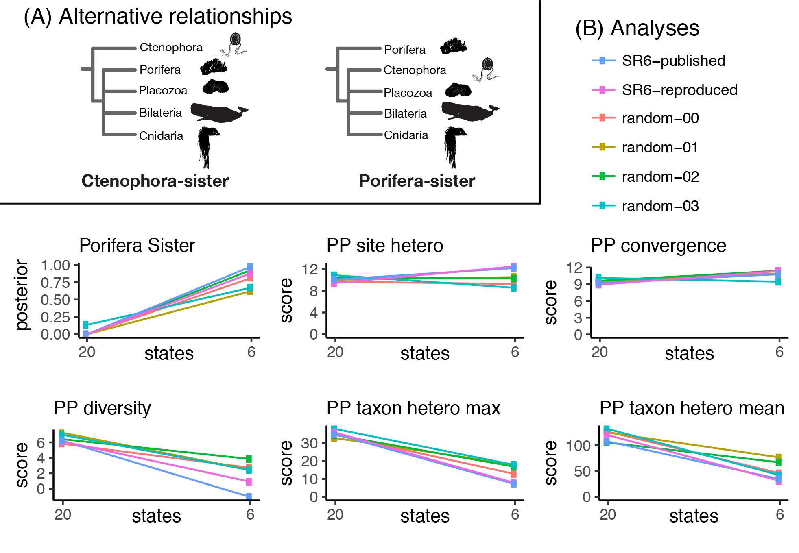
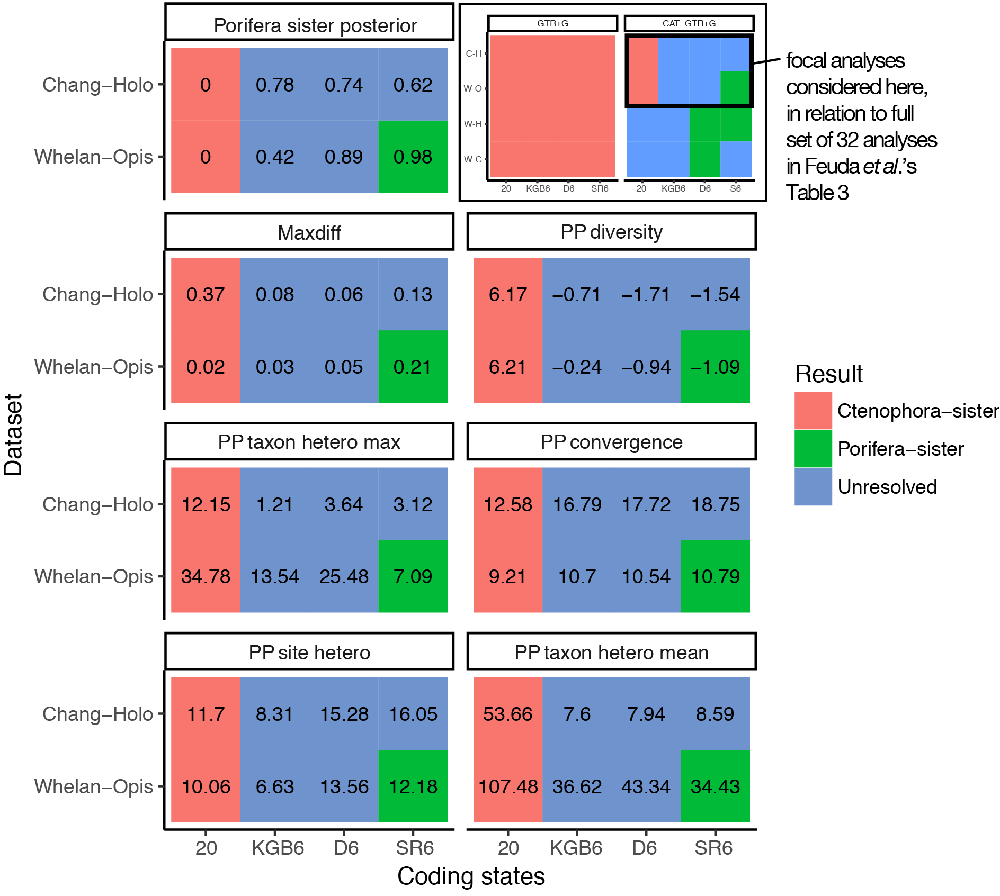

---
output:
  github_document
---

```{r setup, include=FALSE}
knitr::opts_chunk$set(
	message = FALSE,
	warning = FALSE,
	echo=FALSE,
	dpi=300,
	cache=TRUE
	)
```

```{r preliminaries}
library( tidyverse )
library( gridExtra )
library( ape )
library( hutan )
library( magrittr )
library( doParallel )
library( png )
library( scales )


# Set system computational parameters
cores = detectCores() - 1
if ( cores < 1 ) {
	cores = 1
}

# Register parallel workers for %dopar%
registerDoParallel( cores )

# set constants
burnin = 200 # burning for reading tree support

posterior_prob_thresh = 0.95

breaks = c( 20, 6 ) # breakpoints on plots

path_analyses = "recoding/alternative/"

all_legends = FALSE # set to true to validate color scheme

```

```{r load_table3_data}

D = read.table( "tidy_table_3.tsv", header=TRUE, stringsAsFactors=FALSE  )

D$Model = factor( D$Model, c("GTR+G", "CAT-GTR+G" ) )

D$Dataset = sub( "D20", "", D$Dataset )
D$Dataset = sub( "Chang", "Chang-Holo", D$Dataset )
D$Dataset = sub( "Opistho", "Opis", D$Dataset )
D$Dataset = sub( "Choano", "Cho", D$Dataset )
D$Dataset = factor( D$Dataset, c( "Whelan-Cho", "Whelan-Holo", "Whelan-Opis", "Chang-Holo" ) )

D$Recoding[ D$Recoding == "None" ] = "20"
D$Recoding[ D$Recoding == "KGB-6" ] = "KGB6"
D$Recoding[ D$Recoding == "Dayhoff-6" ] = "D6"
D$Recoding[ D$Recoding == "SR-6" ] = "SR6"
D$Recoding = factor( D$Recoding, c("20", "KGB6", "D6", "SR6" ) )

D$Result = "Unresolved"
D$Result[ D$Porifera_sister >= posterior_prob_thresh ] = "Porifera-sister"
D$Result[ D$Ctenophora_sister >= posterior_prob_thresh ] = "Ctenophora-sister"
D$Result = factor( D$Result )

D$Convergence = "bad"
D$Convergence[ D$Maxdiff <= 1 ] = "possible"
D$Convergence[ D$Maxdiff <= 0.3 ] = "acceptable"
D$Convergence[ D$Maxdiff <= 0.1 ] = "good"
D$Convergence = factor( D$Convergence, c( "good", "acceptable", "possible", "bad" ) )

D$Maxdiff = round( D$Maxdiff, 2 )

cteno_color = "#F8766D"
poro_color = "#00BA38"
unresolved_color = "#6F94CD"

```


```{r result_support}

gg_support = 
D %>%
	ggplot( aes( Recoding, Dataset ) ) +
		geom_tile(aes(fill = Porifera_sister)) +
		facet_wrap(~ Model) +
		scale_fill_gradient(low = cteno_color, high = poro_color, limits=c(0, 1)) +
		geom_text(aes(label = Porifera_sister)) +
		ggtitle("Porifera-sister Support") +
		theme_classic()

ggsave( 
	file="figures/Supplemental_Figure_1_manuscript_raw.pdf", 
	device="pdf", 
	width = 6.85, 
	height = 4, 
	dpi = 300, 
	gg_support )

```


```{r result_sub}

D_sub =
	D %>%
	rename( Porifera_sister_posterior = Porifera_sister ) %>%
	filter(Model=="CAT-GTR+G") %>%
	filter( (Dataset=="Whelan-Opis") | (Dataset=="Chang-Holo") ) %>%
	select (-c(Ctenophora_sister, Burnin, effsize, rel_diff)) %>%
	gather( var, val, Porifera_sister_posterior:PPA_MEAN ) %>%
	mutate( 
		var = 
			factor( 
				var, 
				levels = c(
					"Porifera_sister_posterior", 
					"Cycles", 
					"Maxdiff", 
					"PPA_DIV", 
					"PPA_MAX", 
					"PPA_CONV", 
					"PPA_VAR", 
					"PPA_MEAN")
				)
		)

gg_sub =
	D_sub %>%
		ggplot( aes( Recoding, Dataset ) ) +
			geom_tile( aes( fill = Result ) ) +
			facet_wrap( ~ var, ncol = 2 ) +
			geom_text(aes(label = val), size=3) +
			scale_fill_manual( values=c( cteno_color, poro_color,unresolved_color ) ) +
			ggtitle("Variation between analyses") +
			theme_classic()

ggsave( 
	"figures/Supplemental_Figure_2_manuscript_raw.pdf", 
	gg_sub, 
	device=pdf, 
	width=6.5, 
	height=6 
	)

```


```{r read_ppred}

ppred_files = list.files( path=path_analyses, pattern = "\\.ppred$" )
ppred_files = paste( path_analyses, ppred_files, sep="" )

# Static file structure, but check everything is in the right place
expected_test_name_lines = c( 1, 7, 13, 21, 27 )
expected_test_names = c(
	"diversity test",
	"empirical convergence probability test",
	"across-site compositional heterogeneity test",
	"max heterogeneity across taxa",
	"mean squared heterogeneity across taxa"
)

expected_zscore_lines = expected_test_name_lines + 3

ppred =
	lapply(
		ppred_files,
		function( ppred_file ){
			row = 
				str_match( 
					ppred_file, 
					"WhelanD20_AA_mod_transform-([0-9a-zA-Z]+)_states-([0-9]+).chain.ppred" 
					)  # "\\((.*?) :: (0\\.[0-9
			
			dim(row) = NULL
			lines = read_lines( ppred_file )
			if ( ! all( lines[ expected_test_name_lines ] == expected_test_names ) ){
				stop("ppred file not of expected structure")
			}
			z_scores =
				lines[ expected_zscore_lines ] %>%
				str_replace( "z-score : ", "") %>%
				as.numeric()

			Dpp = data.frame(
				file = row[ 1 ],
				transform = row[ 2 ],
				states = as.numeric( row[ 3 ] ),

				# The naming of the ppred scores isn't consistent between the phylobayes
				# manual, the phylobayes ppred output, and Feuda et al. Below are notes
				# used to reconcile these.

				# name in ppred file: diversity test
				# phylobaesmpi flag: -div, "performs a posterior predictive diversity test: 
				#   the test statistic is the mean diversity per site"
				# Feuda et al name: ppa-div, "site-specific amino acid diversity... 
				#  measuring whether models can adequately estimate... the mean number of 
				#  distinct amino acids observed at each site"
				ppa_div = z_scores[ 1 ],

				# name in ppred file: empirical convergence probability test
				# phylobaesmpi flag: -siteconvprob
				# Feuda et al name: ppa-conv
				ppa_conv = z_scores[ 2 ],

				# name in ppred file: across-site compositional heterogeneity test
				# phylobaesmpi flag: -sitecomp
				# Feuda et al name: PPA-VAR
				ppa_var = z_scores[ 3 ],

				# name in ppred file: max heterogeneity across taxa
				# phylobaesmpi flag:
				# Feuda et al name: PPA-MAX
				ppa_max = z_scores[ 4 ],

				# name in ppred file: mean squared heterogeneity across taxa
				# phylobaesmpi flag:
				# Feuda et al name: PPA-MEAN
				ppa_mean = z_scores[ 5 ]
			)

			return( Dpp )
		}
	) %>%
	bind_rows()


Dpp =
	ppred %>%
	gather( ppred, score, ppa_div:ppa_mean)

#Dpp %>%
#	ggplot( aes(x=states, y=score, group=transform, col=transform) ) +
#		geom_line()+
#		geom_point()+
#		scale_x_reverse() +
#		facet_grid( . ~ ppred )

Dpp$transform = paste(rep("random-", length(Dpp$transform)), Dpp$transform, sep="")
Dpp$transform[Dpp$transform == "random-none"] = "SR6-reproduced"

```

```{r read_ppred_published}

original = 
	read.table("./tidy_table_3.tsv", sep="\t", header=T) %>%
	filter( Model == "CAT-GTR+G" ) %>%
	filter( Recoding == "SR-6" | Recoding == "None" ) %>%
	filter( Dataset == "WhelanD20-Opistho" ) %>%
	na.omit() %>% 
	mutate( states = ifelse(Recoding=="None", 20, 6) ) %>%
	gather( ppred, score, PPA_DIV:PPA_MEAN) %>%
	mutate( ppred = str_to_lower(ppred) ) %>% 
	select( states:score ) %>%
	mutate( transform = "SR6-published" )
	

Dpp = bind_rows( Dpp, original )

Dpp$transform = as.factor(Dpp$transform)


#use more descriptive PP names
Dpp$ppred[Dpp$ppred=="ppa_div"] = "PP diversity"
Dpp$ppred[Dpp$ppred=="ppa_conv"] = "PP convergence"
Dpp$ppred[Dpp$ppred=="ppa_var"] = "PP site hetero"
Dpp$ppred[Dpp$ppred=="ppa_max"] = "PP taxon hetero max"
Dpp$ppred[Dpp$ppred=="ppa_mean"] = "PP taxon hetero mean"

```

```{r read_trees}

# Read in trees for each run, calculate cteno-sis and porifera-sis support

fungi = c(
	"Rhizopus_oryzae", 
	"Mortierella_verticillata", 
	"Allomyces_macrogynus", 
	"Spizellomyces_punctatus"  )

porifera = c(
	"Aphrocallistes_vastus",
	"Rossella_fibulata",
	"Sympagella_nux",
	"Hyalonema_populiferum",
	"Ircinia_fasciculata",
	"Chondrilla_nucula",
	"Latrunculia_apicalis",
	"Kirkpatrickia_variolosa",
	"Crella_elegans",
	"Tethya_wilhelma",
	"Pseudospongosorites_suberitoides",
	"Ephydatia_muelleri",
	"Spongilla_alba",
	"Amphimedon_queenslandica",
	"Petrosia_ficiformis",
	"Sycon_ciliatum",
	"Sycon_coactum",
	"Oscarella_carmela",
	"Corticium_candelabrum"
)

ctenophora = c(
	"Euplokamis_dunlapae",
	"Pleurobrachia_bachei",
	"Pleurobrachia_atlantica",
	"Dryodora_glandiformis",
	"Bolinopsis_infundibulum",
	"Mertensiidae_sp",
	"Mnemiopsis_leidyi",
	"Beroe_abyssicola",
	"Vallicula_sp",
	"Coeloplana_astericola"
)

animals_non_poro_cteno = c(
	"Trichoplax_adhaerens", 
	"Petromyzon_marinus", 
	"Danio_rerio", 
	"Homo_sapiens", 
	"Hemithiris_psittacea", 
	"Tubulanus_polymorphus", 
	"Capitella_teleta", 
	"Lottia_gigantea", 
	"Priapulus_caudatus", 
	"Lithobius_forficatus", 
	"Drosophila_melanogaster", 
	"Daphnia_pulex", 
	"Strongylocentrotus_purpuratus", 
	"Saccoglossus_kowalevskii", 
	"Platygyra_carnosa", 
	"Acropora_digitifera", 
	"Aiptasia_pallida", 
	"Hormathia_digitata", 
	"Bolocera_tuediae", 
	"Nematostella_vectensis", 
	"Eunicella_verrucosa", 
	"Aurelia_aurita", 
	"Periphylla_periphylla", 
	"Physalia_physalis", 
	"Nanomia_bijuga", 
	"Agalma_elegans", 
	"Craseoa_lathetica", 
	"Abylopsis_tetragona", 
	"Hydra_viridissima", 
	"Hydra_vulgaris", 
	"Hydra_oligactis"
)


get_clade_frequency = function( trees, clade ){
	x = lapply(trees, function(tree){
		is_monophyletic(tree, clade)
	}) %>% 
		unlist %>% 
		sum
	
	return( x / length(trees) )
	
	
}

#test_name = "WhelanD20_AA_mod_transform-01_states-14.chain.treelist"
#trees = read.tree(test_name)
#burnin = 200
#trees = trees[(burnin+1):length(trees)]


#get_clade_frequency(trees, clade_ctenosis)
#get_clade_frequency(trees, clade_porisis)

clade_ctenosis = c( animals_non_poro_cteno, porifera )
clade_porisis  = c( animals_non_poro_cteno,  ctenophora )

tree_files  = list.files( path=path_analyses, pattern = "\\.treelist$" )
tree_files = paste( path_analyses, tree_files, sep="" )


get_tree_support = function( tree_file ){
			
	row = str_match( tree_file, "WhelanD20_AA_mod_transform-([0-9a-zA-Z]+)_states-([0-9]+).chain.treelist" )  # "\\((.*?) :: (0\\.[0-9
	dim(row) = NULL
	
	trees = read.tree(tree_file)
	burnin = 200
	trees = trees[(burnin+1):length(trees)]
	
	ctenosis = get_clade_frequency(trees, clade_ctenosis)
	porisis = get_clade_frequency(trees, clade_porisis)
	Dts = data.frame(
		file = row[ 1 ],
		transform = row[ 2 ],
		states = as.numeric( row[ 3 ] ),
		ctenosis = ctenosis,
		porisis = porisis
	)
	
	return( Dts )
}
	
tree_support = foreach( tree_file=tree_files ) %dopar%
	get_tree_support( tree_file )

tree_support = tree_support %>% bind_rows()


# Rename transforms

tree_support$transform = paste(rep("random-", length(tree_support$transform)), tree_support$transform, sep="")
tree_support$transform[tree_support$transform == "random-none"] = "SR6-reproduced"

# Add published results, as hard coded from Feuda et al.

pub06 = data.frame(
	file = NA,
	transform = "SR6-published",
	states = 6,
	ctenosis = 0.0,
	porisis = 0.98,
	stringsAsFactors=F )

tree_support = tree_support %>% bind_rows( pub06 )

pub20 = data.frame(
	file = NA,
	transform = "SR6-published",
	states = 20,
	ctenosis = 1.0,
	porisis = 0.00,
	stringsAsFactors=F )

tree_support = tree_support %>% bind_rows(  pub20 )

tree_support$transform = factor( tree_support$transform, levels=levels(Dpp$transform) )
```


```{r plots_pp}
plot_ppa = function( ppred_focal, Dpp, show_legend=FALSE ){
	g_plot = 
		Dpp %>%
			filter( ppred==ppred_focal ) %>% 
			ggplot( aes(x=states, y=score, group=transform, col=transform) ) +
			geom_line()+
			geom_point()+
			scale_x_reverse(breaks=breaks) +
			ggtitle(ppred_focal) +
			expand_limits(y=c(0, NA)) +
			theme_classic()
	
	if( show_legend ){
		return( g_plot )
	}
	else{
		return( g_plot + theme(legend.position="none") )
	}
	
}

# From https://stackoverflow.com/questions/11883844/inserting-a-table-under-the-legend-in-a-ggplot2-histogram
g_legend = function(a.gplot){ 
	tmp = ggplot_gtable(ggplot_build(a.gplot) )
	leg = which(sapply(tmp$grobs, function(x) x$name) == "guide-box") 
	legend = tmp$grobs[[leg]] 
	return( legend )} 

# g_ppa = sapply( unique(Dpp$ppred), function(ppred){ plot_ppa( ppred, Dpp ) } )

ppreds = unique(Dpp$ppred)

#grid.arrange(
#	plot_ppa( ppreds[1], Dpp, all_legends),
#	plot_ppa( ppreds[2], Dpp, all_legends),
#	plot_ppa( ppreds[3], Dpp, all_legends),
#	plot_ppa( ppreds[4], Dpp, all_legends),
#	plot_ppa( ppreds[5], Dpp, all_legends),
#	g_legend( plot_ppa( ppreds[5], Dpp, TRUE ) ),
#	nrow = 2,
#	ncol = 3
#)

```

```{r figure_1, fig.width=6.85 }

states_to_consider = c( 20, 6)

Dpp %<>% filter( states %in% states_to_consider)
tree_support %<>% filter( states %in% states_to_consider)

plot_tree_support = 
	tree_support %>% 
		ggplot( aes(x=states, y=porisis, group=transform, col=transform) ) +
		geom_line()+
		geom_point()+
		scale_x_reverse(breaks=breaks) +
		theme_classic() + 
		theme(legend.position="none") +
		ggtitle("Porifera Sister") +
		ylab("Posterior probability")


lay <- rbind(c(NA,NA,1),
						 c(2,3,4),
						 c(5,6,7))

g = arrangeGrob(
	g_legend( plot_ppa( ppreds[5], Dpp, TRUE ) ),
	plot_tree_support,
	plot_ppa( ppreds[3], Dpp, all_legends),
	plot_ppa( ppreds[2], Dpp, all_legends),
	plot_ppa( ppreds[1], Dpp, all_legends),
	plot_ppa( ppreds[4], Dpp, all_legends),
	plot_ppa( ppreds[5], Dpp, all_legends),
	layout_matrix = lay
)

# grid.arrange( g ) # To render the plot directly in the text

ggsave( file="figures/Figure1_manuscript_raw.pdf", device="pdf", width = 6.5, height = 4, dpi = 300, g )
```


# Response to Feuda *et al.*

Casey W. Dunn

## Summary

In the past decade, some analyses have placed Ctenophora (comb jellies) and others Porifera (sponges) as the sister group to all other animals (Figure 1A). Feuda *et al.* [1] present new phylogenetic analyses that they claim provide conclusive support for the Porifera-sister hypothesis. Their analyses consider datasets from studies by Chang *et al.* [2] and Whelan *et al.* [3], both of which found support for Ctenophora-sister. Feuda *et al.* were concerned that these Ctenophora-sister results were artefacts of lineage-specific differences in amino acid frequencies. In an attempt to reduce these differences, they recoded the full set of twenty amino acids into six groups of amino acids. These groups have more frequent evolutionary changes within them than between them, based on empirical observations in large protein datasets [4]. The intent is to discard many lineage-specific changes, which are expected to fall within these groups. Rather than model compositional heterogeneity, this approach discards heterogeneous information so that much simpler models with fewer states can be applied. They report that posterior predictive (PP) analyses [5] indicate recoded analyses have better model adequacy than amino acid analyses, and "Porifera-sister was favored under all recoding strategies". Here I focus on two aspects of Feuda *et al.* First, I point out that many of their recoded analyses are actually unresolved, and that the analyses with the best PP scores do not provide strong support for Porifera-sister. Second, I present new analyses that show that the impact of recoding is largely due to discarding information, not accommodating variation in amino acid composition across lineages. These findings indicate that it is premature to accept Porifera-sister and reject Ctenophora-sister. The new analyses show that recoding can be a problematic method for addressing compositional variation in phylogenetic analyses.

## Main Text

Feuda *et al.* examine support for Ctenophora-sister and Porifera-sister under all combinations of two models of molecular evolution, four datasets, and four coding schemes. This provides 32 analyses that they report in their Table 3 and that I present graphically here as Supplemental Figure 1. There is striking variation in support for Ctenophora-sister and Porifera-sister across these analyses (Supplemental Figure 1). Feuda *et al.* accept the results of some analyses and reject others based on posterior predictive (PP) analyses of model adequacy, which assess how well a model explains variation in the data (Bollback 2002). They considered five different PP statistics that capture different types of variation in the data, such as the heterogeneity of states across taxa (PP taxon hetero in figures here) and sites (PP site hetero). From this they conclude that their "results strongly support sponges as the sister group of all other animals". 

This conclusion does not follow from their own presented results. Only a single analysis with PP scores provides what could be considered strong support (&ge; `r posterior_prob_thresh` posterior probability) for Porifera-sister. Of the 32 analyses, PP scores were calculated for 16 (those for the full Whelan and Chan matrices). Based on PP scores, Feuda *et al.* reject eight of these that were conducted under the GTR+G model (which all have strong support for Ctenophora-sister). This leaves eight CAT-GTR+G analyses (Supplemental Figure 2). Two of these eight are analyses of the original 20-state amino acid data, both of which provide strong support for Ctenophora-sister. Of the six recoded analyses, five are unresolved. Only a single analysis for which PP scores are available provides strong support for Porifera-sister, the CAT-GTR+G analysis of the SR-6 [4] recoded Whelan [3] matrix. Furthermore, this analysis does not have the best score according to any of the five PP statistics they considered (Supplemental Figure 2). The only statistic that stands out for this one analysis is that it has the highest maxdiff (Supplemental Figure 2), indicating that it did not converge as well as other analyses. It should also be noted that none of the reanalyses of Chang matrix provide strong contradiction of that original study. Chang *et al.* [2] found strong support for Ctenophora-sister, and all of the reanalyses of this same matrix by Feuda *et al.* also have strong support for Ctenophora-sister or are unresolved.

Though their study does not provide strong support for Porifera-sister, the sensitivity of their results to recoding provides an opportunity to better understand and evaluate the impact of recoding more generally. This is important given the growing interest in recoding [1]. Feuda *et al.* hoped recoding would reduce potential artefacts due to differences across species in amino acid frequencies. They interpreted the fact that their analyses are sensitive to recoding as evidence that such an artefact exists and that they successfully addressed it by recoding. An alternative hypothesis is that recoding impacts phylogenetic analyses simply because it discards so much information. These two hypotheses can be tested by applying new recoding schemes that also reduce twenty states down to six, but are based on random grouping rather than empirical frequencies of amino acid exchange. Empirical and random recodings both discard the same amount of information, but only empirical recoding could reduce the impact of amino-acid frequency as intended. Different results between empirical and random recoding would be consistent with the hypothesis that the empirical approach works as intended to accommodate differences in amino acid frequencies across species. Similar results would suggest that the impact of recoding on phylogenetic results is due to discarding data. Here I focus on the single original analysis with a PP score that supports Porifera-sister, the CAT-GTR+G analysis of the SR-6 recoded Whelan data. I created four new random recoding schemes by shuffling the amino acids in the SR-6 scheme (analysis code is available in a git repository at https://github.com/caseywdunn/feuda_2017). When I applied each of these randomized codes to the Whelan matrix and analyzed them under the CAT-GTR+G model with phylobayes-mpi [6], I observed similar results as for the empirical SR-6 recoding. Like SR-6 recoding, random recoding increases support for Porifera-sister and improves the apparent adequacy of models to explain heterogeneity of states across taxa (PP taxon hetero mean and max, Figure 1B). 

These analyses indicate that the major impact of recoding on phylogenetic analyses is data reduction, not reduction of compositional variation across species. This suggests that recoding may not be an effective tool for accommodating among-species differences in amino acid frequencies more generally. Compositional heterogeneity would be better addressed with models of molecular evolution that explicitly describe such differences [7,8], if progress can be made on the considerable computational challenges of such complex models. 

### Author Contributions
CWD performed all analyses and wrote the manuscript.

## References

1.	Feuda, R., Dohrmann, M., Pett, W., Philippe, H., Rota-Stabelli, O., Lartillot, N., Wörheide, G., and Pisani, D. (2017). Improved Modeling of Compositional Heterogeneity Supports Sponges as Sister to All Other Animals. Curr. Biol. 27, 3864–3870.e4.
2.	Chang, E.S., Neuhof, M., Rubinstein, N.D., Diamant, A., Philippe, H., Huchon, D., and Cartwright, P. (2015). Genomic insights into the evolutionary origin of Myxozoa within Cnidaria. Proc. Natl. Acad. Sci. U. S. A. 112, 14912–14917.
3.	Whelan, N.V., Kocot, K.M., Moroz, L.L., and Halanych, K.M. (2015). Error, signal, and the placement of Ctenophora sister to all other animals. Proc. Natl. Acad. Sci. U. S. A. 112, 5773–5778.
4.	Susko, E., and Roger, A.J. (2007). On reduced amino acid alphabets for phylogenetic inference. Mol. Biol. Evol. 24, 2139–2150.
5.	Bollback, J.P. (2002). Bayesian model adequacy and choice in phylogenetics. Mol. Biol. Evol. 19, 1171–1180.
6.	Lartillot, N., Rodrigue, N., Stubbs, D., and Richer, J. (2013). PhyloBayes MPI: phylogenetic reconstruction with infinite mixtures of profiles in a parallel environment. Syst. Biol. 62, 611–615.
7.	Blanquart, S., and Lartillot, N. (2008). A site- and time-heterogeneous model of amino acid replacement. Mol. Biol. Evol. 25, 842–858.
8.	Foster, P.G. (2004). Modeling compositional heterogeneity. Syst. Biol. 53, 485–495.

### Figure


**Figure 1.** (A) The two alternative hypotheses for deep animal relationships considered here. Relationships that are not part of these hypotheses are shown as unresolved polytomies. (B) Each of the six plots presents one statistic, which include Posterior probability of Porifera-sister and the five Posterior Predictive (PP) statistics considered by Feuda *et al.* Within each plot, there are six lines for six different analyses. These six analyses are the published SR-6 analyses presented by Feuda *et al.* (SR6-published), reproduced analyses obtained by applying the same methods to the same data (SR6-reproduced), and four analyses based on randomized recoding matrices obtained by shuffling the SR-6 coding scheme (random-00 – random-03). Each analysis includes results for 20 states (the raw amino acid data, shown by the left point) and for 6 states (the 6-state recoded data, shown by the right point). For each statistic, the results obtained with the random recoding are similar to those of the SR6 recoding. This indicates that the impact of recoding is dominated by discarding data when collapsing from 20 states to 6 states, not accommodating compositional heterogeneity across lineages.

\pagebreak

## Supplemental Information

### Supplemental methods

All code used for the analyses presented here is available in a git repository at https://github.com/caseywdunn/feuda_2017. The version of the code executed to present the results here has tag `cb_submission`. The randomized recoding analyses are in the `recoding/alternative` subdirectory of the git repository. 

The original SR-6 recoding scheme is "`APST CW DEGN FHY ILMV KQR`" [4], where spaces separate amino acids that are placed into the same group. 

The `alt_recode.py` script was used to generate the randomized recoding schemes and apply the recodings to the data. To create the randomized recoding schemes, the amino acids in the SR-6 recoding were randomly reshuffled. This creates new recodings that have the same sized groups as SR-6. The new recodings were, from `random-00` to `random-03`:

    MPKE AY IDGQ TRC WNLF SVH
    EIFT WL QVPG NKM SCHA RYD
    LCQS GK WPTI VRD YEFN MAH
    IWQV TY KDLM ESH APCF GRN

To apply these to the data, each amino acid was replaced with the first amino acid in the group. When applying `random-00`, for example, each instance of `R` and `C` would be replaced by a `T`. 

The 20 state matrices are the same across all analyses since they are not recoded. Since all the 20 state matrices are all the same, variation between 20-state results (as in the left side of each pane of Figure 1B) give insight into the technical variance of the inference process.

Each new matrix was analyzed with phylobayes-mpi version 1.8. Analyses were run for 1000 generations, and a 200 generation burnin applied. The resulting tree files and PP scores were parsed for display with the code in https://github.com/caseywdunn/feuda_2017/manuscript.rmd .

The statistics presented in Supplemental Figures 1 and 2 were parsed from the Feuda *et al.* manuscript into the file `tidy_table_3.tsv` and rendered for display with the code on the source file for this document.


### Supplemental figures

```{r result_sig, fig.width=6.5, fig.height=3.1}

gg_sig =
	D %>%
		ggplot( aes( Recoding, Dataset ) ) +
			geom_tile( aes( fill = Result ) ) +
			facet_wrap( ~ Model ) +
			theme_classic()

#ggsave( "figures/figure_3.pdf", gg_sig, device=pdf, width=6.5, height=3.1 )

gg_sig

```
**Supplemental Figure 1.**  A grapchical representation of the posterior probabilities for the 32 analyses presented by Feuda *et al.* in their Table 3. Cells are color coded by whether posterior probability is &ge; `r posterior_prob_thresh` for Porifera-sister,  &ge; `r posterior_prob_thresh` for Ctenophora-sister, or neither (unresolved). Posterior predictive (PP) statistics were estimated for the 16 analyses in the top two rows of this figure.




**Supplemental Figure 2.** The subset of eight CAT-GTR+G analyses with posterior predictive (PP) scores that is the focus of Feuda *et al.*'s primary conclusions. These are a subset of the 32 analyses presented in their Table 3 and graphically here in the upper right pane. The eight analyses are for two datasets (Chang and Whelan) and four coding schemes. The coding schemes are the original 20 state amino acid data, and three different six state recodings that group amino acids based on different criteria: KGB6, D6, and SR6. Cells are color coded as in Supplemental Figure 1. Only one of these analyses, the SR6 coding of the Whelan matrix, has &ge; `r posterior_prob_thresh` support for Porifera-sister. The 20-state and 6-state points on the plots in Figure 1 of the main text correspond to the 20 and SR6 Whelan cells shown here. The presented statistics for these cells are posterior probability of Porifera-sister, Maxdiff (with lower scores indicating better convergence of runs), and five PP statistics (where lower absolute value indicates better model adequacy). The only one of these eight analyses that provides strong support for Porifera-sister is not the most adequate analysis by any of the PP scores, and showed the poorest convergence according to Maxdiff.

