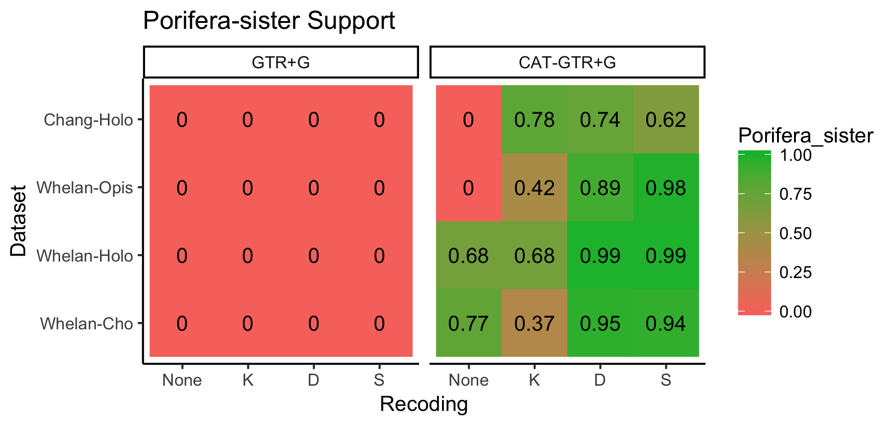
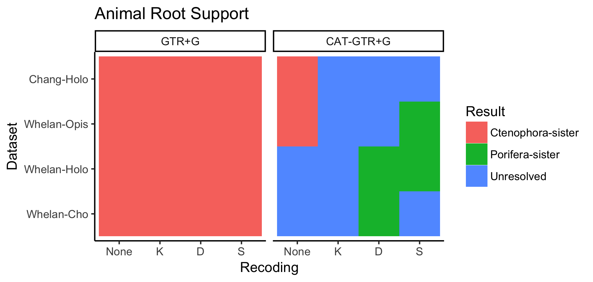
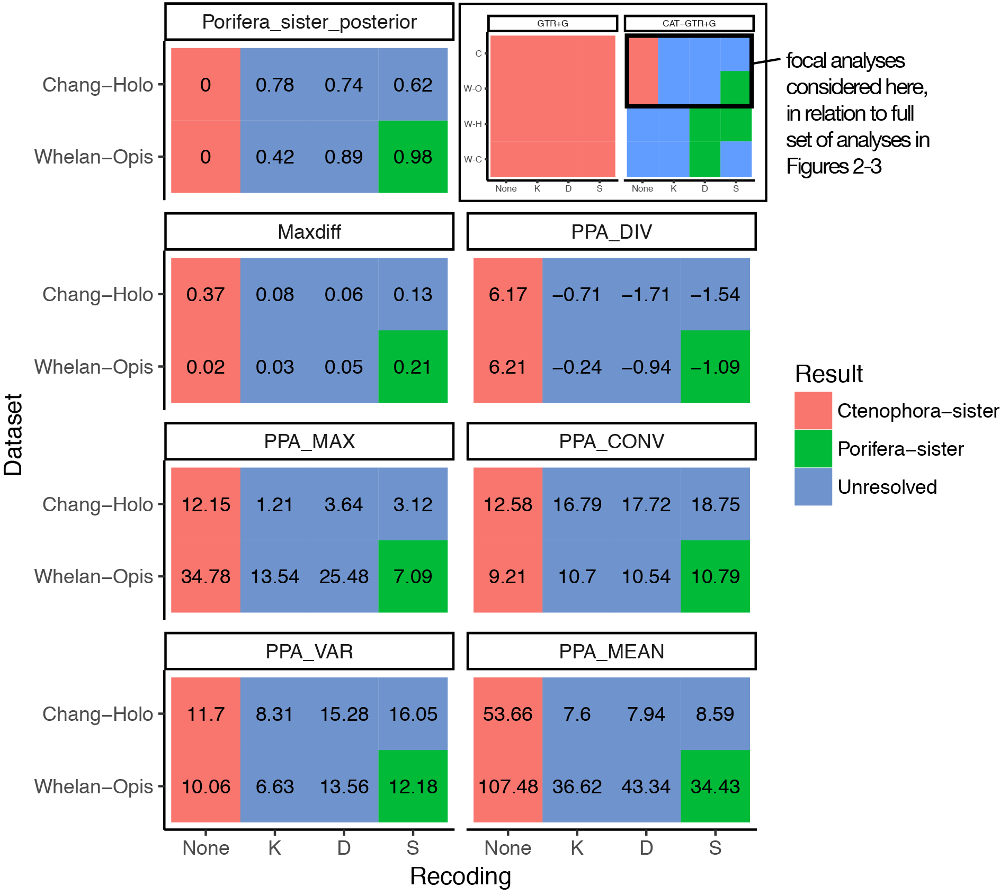

How are ctenophores and sponges related to other animals?
=========================================================

#### Casey W. Dunn, Department of Ecology and Evolutionary Biology, Yale University, <http://dunnlab.org>

There has been great interest in resolving the deepest evolutionary relationships in the animal tree of life. This comes down to resolving the relationships between five clades - Cnidaria, Bilateria, Placozoa, Porifera (sponges), and Ctenophora (comb jellies). The deepest split in the animal tree has been of particular interest, with most recent studies finding either Ctenophora or Porifera to be the sister group to all other animals. These are referred to as the Ctenophora-sister and Porifera-sister hypotheses (Figure 1).

*Figure 1- Overview. The two alternative hypotheses for deep animal relationships considered here. In the Ctenophora-sister hypothesis ctenophores are the sister group to all other animals, i.e. there is an internal branch in the animal phylogeny that separates ctenophores from all other animals (shown in red). In the Porifera-sister hypothesis sponges are the sister group to all other animals, i.e. there is an internal branch in the animal phylogeny that separates sponges from all other animals (shown in green). Other relationships that are not part of these hypotheses are shown as an unresolved polytomy. Figure adapted from [Dunn et al. 2014](http://www.annualreviews.org/doi/10.1146/annurev-ecolsys-120213-091627). Colors are based on the graphical abstract of Feuda et al. 2017.*

Over a series of studies from the past 10 years, it has come to be well known that the phylogenetic positions of ctenophores and sponges are highly sensitive to model of molecular evolution, species sampling, and gene sampling (reviewed in [Dunn *et al.* 2014](http://www.annualreviews.org/doi/10.1146/annurev-ecolsys-120213-091627)). In the course of exploring this sensitivity, some studies have concluded that there is strong support for Porifera-sister, some have concluded that there is strong support for Ctenophora-sister, and some have concluded there is not yet enough evidence to definitively reject either hypothesis. My own take on the question falls into this last category.

In a recent paper, [Feuda *et al.* 2017](https://doi.org/10.1016/j.cub.2017.11.008) claim to present strong, significant support for Porifera-sister and to have resolved the question at last. Feuda *et al.* present a well-blocked set of phylogenetic analyses that examine support for Ctenophora-sister and Porifera-sister under a variety of conditions. They consider several factors:

-   Model of molecular evolution. The primary analyses consider the GTR+G and CAT-GTR+G models. Both models accommodate different rates of change between states (General Time Reversible, GTR) and among-site rate variation (Gamma Distribution of rates, G). In addition, CAT-GTR+G accommodates different state frequencies across sites (Categorical model, CAT).

-   Dataset. They examine two matrices from previous publications, [Whelan *et al.* 2015](https://www.doi.org/10.1073/pnas.1503453112) and [Chang *et al.* 2015](https://www.doi.org/10.1073/pnas.1511468112).

-   Outgroup sampling. For the Whelan matrix, they consider three sets of species sampling with progressively reduced outgroups - Opisthokonta, Holozoa, and Choanimalia. They do not vary outgroup sampling for the Chang matrix, which includes species from Holozoa. Removing outgroups is a form of data reduction.

-   Character recoding. They recoded amino acids with similar chemical properties as the same character using three different schemes (KGB-6, Dayhoff-6, SR-6). This recoding is a form of data reduction - rather than remove species or sites, it removes dynamic range within each cell of the matrix. The motivation of this recoding is to minimize the impacts of compositional bias, since different lineages and genes may tend to use different amino acids with similar properties.

This blocking of 2 models for 4 matrices for 4 types of character coding results in 32 analyses that form the central results of their study.

They interpret these results as providing strong significant support for Porifera-sister.

Here are a couple of the highlights that accompany their paper:

> Sponges are the sister group of the remaining animals
>
> Trees showing comb jellies as the sister of all the other animals are artifactual

Here are some excerpts from their abstract:

> Increased model adequacy is associated with significant topological changes in support of Porifera-sister.

> Because adequate modeling of the evolutionary process that generated the data is fundamental to recovering an accurate phylogeny \[16–20\], our results strongly support sponges as the sister group of all other animals and provide further evidence that Ctenophora-sister represents a tree reconstruction artifact.

On social media and in comments to the press the tone of their claims have been even stronger, where they have declared this manuscript to be the last word in the debate and the question to be resolved. Take, for example, the following quote by one of the study co-authors from the Guardian article *[Evolution row ends as scientists declare sponges to be sister of all other animals](https://www.theguardian.com/science/2017/nov/30/evolution-row-ends-as-scientists-declare-sponges-to-be-sister-of-all-animals?CMP=share_btn_tw)*:

> While \[co-author\] Pisani believes proponents of the comb jellies might continue the debate, he says the wrangle is drawing to a close. “From my perspective, yes, this is the last word,” he said.

And from a press release *[In the beginning there was the sponge](http://www.en.uni-muenchen.de/news/newsarchiv/2017/woerheide_schwammanalysen.html)* describing their new paper:

> ... their results are unequivocal: The sponges form the earliest branch on the animals' family tree... "Our results confirm the classical assumptions concerning early animal evolution, and should help to put an end to the recent controversy over the origin of multicellular animals," Wörheide concludes.

Strong claims of course require strong evidence, so let's take a look at the evidence presented in their manuscript.

The results of Feuda *et al.* 2017
----------------------------------

The central findings of Feuda *et al.* 2017 are presented in their Table 3. It is reproduced below.

*Table 3 from Feuda et al. 2017.*

I reorganized the data in this table and color coded the cells to get a better view of the general pattern of support for Porifera-sister. This reorganized table is presented below as Figure 2.

*Figure 2 - Posterior probabilities for Porifera-sister. Recodings are: None- original amino acid data, K - KGB-6, D - Dayhoff-6, and S- SR-6.*

I next color coded the results by significance, assessed as a posterior probability ≥ 0.95. This is a low threshold, most Bayesian phylogenetic studies apply a more stringent (higher) threshold to assess significance. The significance of the results is presented below in Figure 3.

*Figure 3 - Significance of posterior probabilities for Porifera-sister assessed as posterior probability ≥ 0.95. *

There are a few striking patterns in these results, which I explore below.

### Model

All analyses under GTR+G (Figure 3, left panel) recover significant support for Ctenophora-sister, and some analyses (Figure 3, right panel) under CAT-GTR+G recover Porifera-sister.

Feuda *et al.* 2017 examine model fit and adequacy and come to the conclusion that the CAT-GTR+G model is the best available model for the data. Let's therefore only consider the more complex CAT-GTR+G model further.

The results are quite variable under the CAT-GTR+G model (Figure 3, right panel). Let's break this down:

-   Both full matrices support Ctenophora-sister under the CAT-GTR+G model (Figure 3, right panel, left column, top two cells).
-   Most analyses under the CAT-GTR+G model do not provide significant support for either Ctenophora-sister or Porifera-sister (Figure 3, right panel, 10 blue cells)
-   A subset of matrices with reduced species sampling and recoded data provide significant support for Porifera-sister (Figure 3, right panel, 4 green cells)

There is significant support for Porifera-sister in only one quarter of CAT-GTR+G analyses.

### Data reduction

The different results within the 16 CAT-GTR+G analyses are due to different approaches to data reduction: (1) recoding data in both the Whelan and Chang matrix, and (2) removing outgroups from the Whelan matrix.

While the full amino acid matrix of Chang (Figure 3, right panel, top left red cell) provides significant support for Ctenophora-sister, the recoded analyses are unresolved (Figure 3, right panel, remainder of top row) and none provide significant support for Porifera-sister.

Authors of Feuda *et al.* 2017, in that manuscript and others (*e.g.* [Pick *et al.* 2010](https://doi.org/10.1093/molbev/msq089), have strongly argued that broader outgroup sampling has a *negative* impact on this particular phylogenetic question. This is counter to the common understanding in the field that broad outgroup sampling is critical to rooting problems like this one. Given this assertion, it is interesting that reducing outgroup sampling in the Whelan matrix (Figure 3, right panel, left row bottom two cells) does not provide significant support for Porifera-sister.

The strong conclusions the authors made based largely on Table 3 therefore rest entirely on recoding the Whelan matrix and applying the CAT-GTR+G model. These results are central to the paper since they include the only results with significant support for Porifera-sister. The authors also indicate that these recodings do a good job addressing issues they are concerned with in other analyses:

> All recoded datasets obtained lower Z scores than the original amino acid datasets for both PPA-MAX and PPA- MEAN (Tables 1 and S1), indicating that recoding is effective at reducing lineage-specific compositional heterogeneity.

Despite the author claim that this method addresses key technical problems, less than half (4/9) of these recoded Whelan CAT-GTR+G analyses (Figure 3, right panel, bottom right 9 cells) provide significant support for Porifera-sister. The results are still sensitive to the recoding strategy used and outgroup sampling. It also calls into question the robustness of results under recoding strategies. For example, none of the KGB-6 recoded analyses provide significant support for Porifera-sister, despite having improved adequacy similar to that of other recodings and relying on very similar data reduction transforms.

Though the authors interpreted these recoded analyses as showing conclusive support for Porifera-sister, closer examination of the results instead indicates that improved method adequacy does not always provide stronger support for Porifera-sister and variation in support remains largely unexplained.

### Reporting results

Some of these results in Table 3 were clearly described by Feuda *et al.* 2017, and others were not addressed. There are, however, also some inconsistencies between the presented results and the description of the results in the text. The overall impact is that the text presents much stronger support for Porifera-sister than is actually present in the results.

For example:

> Porifera-sister was favored under all recoding strategies.

This is not the case. Only 4 of the twelve analyses of recoded data presented in Table 3 show significant support for Porifera-sister (Figure 3). Some recoded analyses have a posterior probability &lt; 0.5 for Porifera-sister.

> Data recoding reduced the impact of heterogeneity on our phylogenetic analyses (see also \[7\]), and this lent support to Porifera-sister. Notably, this result emerged independently of the outgroups included.

This is not the case. The recoded Whelan CAT-GTR+G analyses are sensitive to outgroup sampling, both in magnitude of posterior probability (Figure 2, right panel, bottom right 9 cells) and significance of posterior probability (Figure 3, right panel, bottom right 9 cells).

Sensitivity and the support landscape
-------------------------------------

The sensitivity of phylogenetic analyses to taxon sampling, gene sampling, and analysis methods is often viewed as troublesome result. It provides very important insight, though, into the methods we use and the biological questions we apply them to. After ten years of intensive study, the placement of sponges and ctenophores have become one of the most thoroughly explored difficult phylogenetic problems. Examining the sensitivity of results will help us advance this particular question, and may also provide insight into how to address other hard phylogenetic questions.

Feuda *et al.* explain why they interpret their results as evidence for Porifera-sister, even though support is sensitive to multiple factors, as follows:

> The relationships at the root of the animal tree depend on model adequacy, with Ctenophora-sister emerging more prominently when the data are modeled less adequately and Porifera-sister being better supported when the data are more adequately modeled (Figure 1). As phylogenetic methods are less likely to recover artifactual topologies when the models of evolution more adequately describe the data \[16–20\], we conclude that Porifera-sister better represents the phylogenetic signal in the data.

> This model-dependent outcome has been interpreted as reflecting a fundamental lack of robustness \[59\], and it has been suggested that the relationships at the root of the animal tree might be impossible to reconstruct based on current amino acid datasets \[2, 4\]. However, sensitivity to the model (and to other analytical factors) does not imply an impossibility to decide which solution is most likely to be correct... the varied outcomes of phylogenetic analyses of animal relationships show a clear pattern, with Ctenophora-sister being systematically associated with the use of inadequate models and/or taxon-sampling schemes that are most likely to exacerbate systematic errors.

It is certainly true that model sensitivity alone does not mean we can reject a given phylogenetic hypothesis. There are an infinite number of possible models, and it is essentially certain that for any given phylogenetic hypothesis there is a model out there somewhere that will reject it. The question is how we use variation in support to put each result in a broader context that allows us to interpret it.

We can think of this variation as a support landscape - a multidimensional space that shows how support varies across different gene sampling, taxon sampling, and analysis methods. It is only ever possible to probe a finite region of this landscape, but its overall shape has radical implications for how we interpret a particular set of results. This means that when investigating sensitivity it is necessary to be explicit not only about the results we get in a given study, but how we are thinking about regions of the support landscape that are adjacent to those we examine.

The excerpts from Feuda *et al.* suggest that the authors implicitly envision the broader support landscape to be a monotonic surface (Figure 4a). They believe that the small part of the support landscape they probed (Figure 4, inset boxes) indicates a broader pattern that they interpret as strong support for Porifera-sister. This is because, although most analyses they did support Ctenophora-sister there are some analyses on the right edge of the sampled space that recover significant support for Porifera-sister.

 *Figure 4 - Hypothetical support landscapes. The inset box shows the region of the landscape explored by Figures 2-3. The horizontal axis represents variation in analysis methods, such as model of molecular evolution and recoding of data. The vertical axis represents variation in sampling of genes and species. (a) A Monotonic Support Landscape. (b) A Sponge-Island Support Landscape, which would indicate that sponges support is only obtained in a very small portion of the support landscape. (c) A Hilly Support Landscape.*

Other support landscapes would have very different implications for the results they obtained. A small fraction of analyses may have supported Porifera-sister because they happened to sample a small island of support (Figure 4b) in a broader landscape that overall has patterns of support consistent with Ctenophora-sister. Alternatively, the small island of support for Porifera-sister may indicate a transition from a plateau of support for Ctenophora sister to a hilly support landscape to the east. It is unlikely that we would conclusively resolve the placement of ctenophores and sponges if this broader hilly pattern were found to be the case.

The work of Feuda *et al.* 2017 provides an enticing peek at a portion of this landscape, but without broader context still fails to allow us to come to strong conclusions. Exploring additional sensitivity will help us understand this bigger picture. In this sense, sensitivity is an asset rather than a liability.

Moving beyond the last word
---------------------------

Feuda *et al.* 2017 was not the last word in resolving the root of the animal tree. So what next?

One of the most critical steps to take is to change the way we talk about the problem. In particular, non-significant phylogenetic results should not be presented as definitive resolutions of tough problems. This should always apply, but especially so in the case of highly contested questions of such broad interest. Making strong statements about non-significant results gives the impression that phylogenetic methods are broken as a question seems to bounce from one extreme answer to the other. They are not. How we talk about phylogenies is broken.

Overstating results has given the entirely wrong impression to the broader community of where the Ctenophora-sister and Porifera-sister hypotheses stand. It is not the case that different groups of investigators are doing the same thing and getting radically different results. They are looking at similar results that consistently show sensitivity to multiple factors, and drawing very different conclusions about the implications of that sensitivity.

When I look at the entirety of the impressive work done by multiple very talented groups on testing Ctenophora-sister and Porifera-sister, I come to the conclusion that at this time we cannot reject either hypothesis. I just don't find the sensitivity to species sampling, gene sampling, model selection, and now character coding conclusive. I also find the interactions between these factors concerning. We need a broader perspective of the support landscape to put the interesting results we already have into context before we can understand the implications of sensitivity for these hypotheses.

GTR+G and CAT-GTR+G are very similar models that were implemented in carefully controlled ways by Feuda *et al.* 2017, yet provide very different results. What will happen when we consider other similar, adjacent models? It isn't surprising when highly different models give different results, but when adding a single set of parameters gives a radically different result we should be skeptical that we have the final word in the problem under either model. The fact that the authors claim that "recoding is effective at reducing lineage-specific compositional heterogeneity", yet still get highly inconsistent results in different recoded analyses is also problematic. It is also interesting to note that authors of Feuda *et al.* declared another set of analyses ([Pisani *et al.* 2015](http://dx.doi.org/10.1073/pnas.1518127112)) to be the [nail in the coffin of Ctenophora sister](https://twitter.com/gwoerhe/status/671636958926499841) even though it did not use the recoding strategy that they now claim to be essential to testing these hypotheses. Such strong claims manufacture controversy where there is none and, in combination with moving goal posts, give the impression that the only consistent criterion they apply for detecting problems with analyses is finding that they support Ctenophora-sister.

I think that the rigorously blocked approach that Feuda *et al.* 2017 very exciting and the way of the future. It can provide a clear picture of the support landscape as it depends on different factors and their interactions. We need to expand this approach.

I am optimistic that there will be significant progress on this problem in coming years. Analysis methods and tools are rapidly improving. New high-quality genome data will soon be available for many more species that are highly relevant to this question. For example, just a few days after Feuda *et al.* 2017 was published, [Belahbib *et al.*](https://www.biorxiv.org/content/early/2017/12/04/228452) posted a preprint presenting two new sponge genome sequences and analyses directly relevant to interpreting the biological significance of Ctenophora-sister and Porifera-sister. I look forward to to seeing how further advances in analyses and sampling push tests of Ctenophora-sister and Porifera-sister into new areas of the support landscape and allow us to chart its broader features. And, of course, I am excited about the impact this work will have on our understanding of animal evolution.

Porifera may very well be the sister group to all other animals, but declaring them to be sister based on inconsistent and inconclusive results will make it harder to find out if they are. It discourages the very work that still needs to be done to test Porifera-sister and Ctenophora-sister. It also alienates so many people who want to know the answer (and to make progress on other hard phylogenetic problems) because it makes it seem like phylogenetic methods give radically different results from one day to the next.
